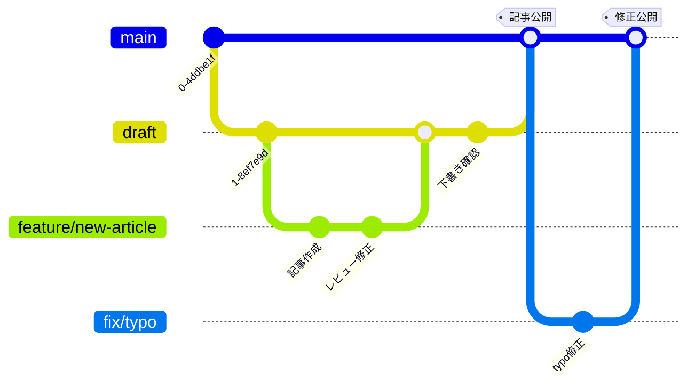

# Qiita-content

qiitaの記事を同期・執筆・投稿するためのリポジトリ

## 使い方

### 環境設定

https://github.com/increments/qiita-cli 参照。

### 新規記事の作成

```bash
npx qiita new 記事のファイルのベース名
```

### プレビュー画面の表示

```bash
npx qiita preview
```

http:localhost:8888 でプレビュー画面が表示されます。

### Qiitaへの投稿

masterブランチにpushすると、自動的にQiitaへ投稿されます。

### 投稿記事の同期

```bash
npx qiita pull
```

## ブランチ戦略

- `main` ブランチ: Qiitaに投稿される記事を管理するブランチ
- `draft` ブランチ: 執筆中の記事を管理するブランチ
- `feature/xxxx` ブランチ: 新規記事を執筆するためのブランチ
- `fix/xxxx` ブランチ: 既存記事の修正を行うためのブランチ




### ブランチ運用フロー

1. 新規記事作成
   ```bash
   git checkout draft
   git checkout -b feature/記事名
   # 記事の作成・編集
   git add .
   git commit -m "article: 記事の追加"
   git push origin feature/記事名
   ```

2. レビュー・修正
   - feature ブランチから draft へプルリクエストを作成
   - 自己レビュー後、draft へマージ

3. 記事公開
   - draft から master へプルリクエストを作成
   - 最終確認後、master へマージ（自動で Qiita へ公開）

4. 公開後の修正
   ```bash
   git checkout -b fix/記事名
   # 修正作業
   git add .
   git commit -m "fix: typo修正"
   git push origin fix/記事名
   ```
   - fix ブランチから master へプルリクエストを作成
   - 確認後、master へマージ